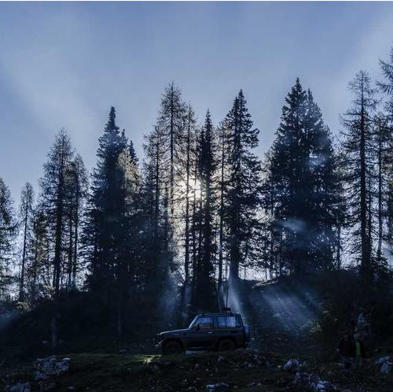
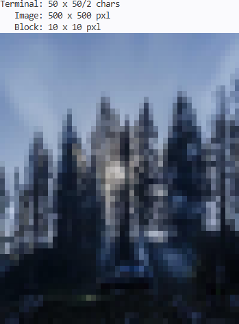
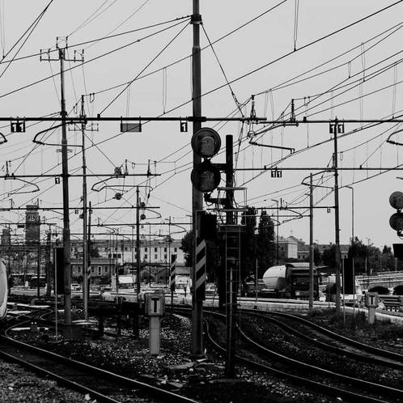
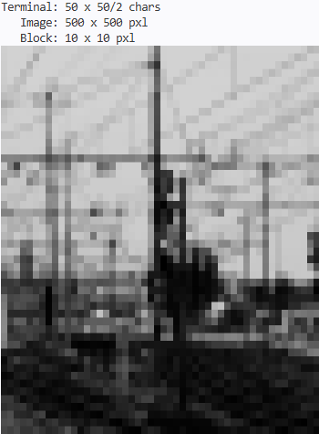
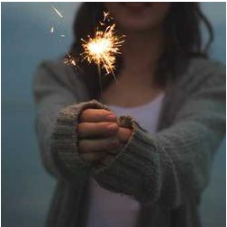
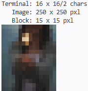
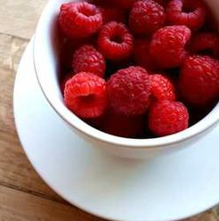
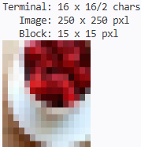

# terminal-picture

## Project Idea
Display images directly in your terminal using ANSI truecolor. <br>
The desired output resolution is defined as an N × M pixel array.
Then the image is evaluated in 'blocks' to scale down from the input resolution to the output resolution.
For each 'block' the RGB value is averaged.

To actually display the image, the half-block Unicode character (▄) is made use of. Each character in the terminal has independently controllable foreground and background colors. Since the half-block character splits the foreground and background perfectly in half, it allows a single character cell to represent two vertically adjacent pixels.

The picsum-photos API allows you to fetch a random image of a given resolution. This API will fetch an image which is then fed in as the input image.

Note that the output dimension will be N x M pixels. However, the size in the terminal will differ from the set N x M array.
Since 2 rows fit in one character, the actual output size in the terminal will be: $$ N \times \lceil M / 2 \rceil \text{ characters}$$
In the case that M is odd, a row of black pixels will be filled in at the bottom.


### Flow
1. Query Picsum-Photos API to receive a random image.
2. Define a terminal-output size.
3. Determine the size of each 'block'
    * This is found by dividing the width and height of the image by the width and height of the output array.
4. Average the RGB value of all pixels in each block
5. Write the averaged-RGB values to a screen buffer.
6. Iterate through the screen buffer, skipping every other row.
    * Pull the RGB value from the screen buffer at (row, col) and (row + 1, col).
    * Use ANSI escape sequences to display character with an RGB value for both foreground and background.
    
## Examples
<b>All images used have been pulled from the 
Picsum-Photos API. </b>

500x500 pixel Image → 50 x 50 pixel Output <br>





250x250 pixel image → 16 x 16 pixel Output <br>





## Setup
### Prerequisites
- Rust and Cargo
    * https://rust-lang.org/tools/install/ 
- A terminal with ANSI truecolor support
- An internet connection
    * Not required when using ```manual``` tag.

### Clone the repository
``` 
git clone https://github.com/PatrickWacholtz04/terminal-picture.git
cd picture
```


## Usage
The project can be run with 3 optional arguments
```
cargo run -- Width Height Manual
```
* Width: Specifies the output width (Default 16)
* Height: Specifies the output height(Default 16)
* Manual: Determines whether to fetch an image from Picsum-Photos API (Default False)

When using Manual mode, you will need to name the desired image ```image.jpg```
and place it into the project at ```../picture/images```
    * If the project is later run without the Manual argument, it will overwrite the image.


